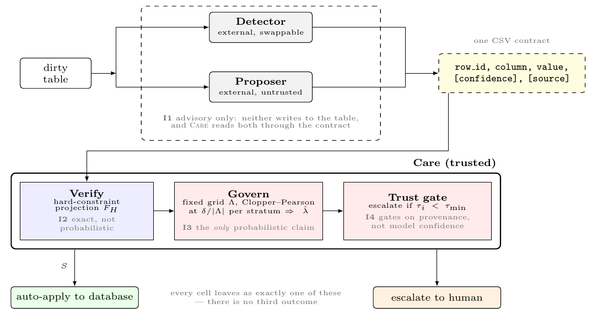
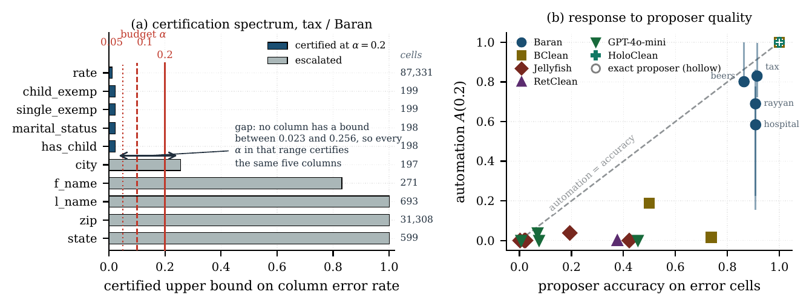
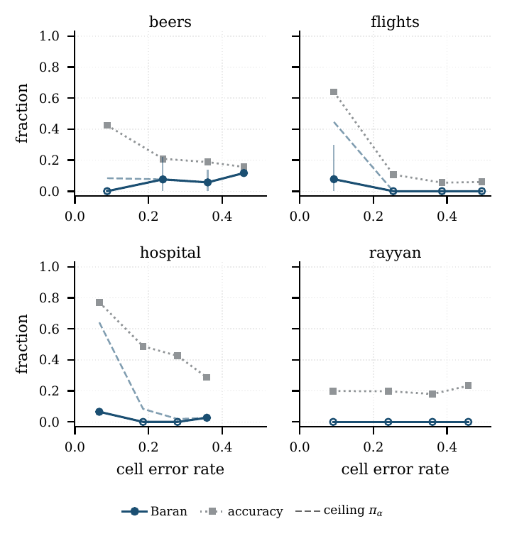

# CARE — Certifiable Automation for Data Repair

CARE is a **governance layer, not a cleaner**. It sits between an arbitrary data-repair
system (the *proposer*) and the database, and decides for each proposed repair whether it
may be auto-applied or must be escalated to a human, under a distribution-free bound on
the error rate of the auto-applied set at a user-chosen budget α with confidence 1−δ.

The proposer is untrusted and unmodified: CARE reads one CSV contract and never imports a
cleaner's code. The study in this repository governs six of them — Baran, BClean,
HoloClean, Jellyfish, RetClean and GPT-4o-mini — across five standard repair benchmarks.

```
row_id, column, value, [confidence], [source]      # empty value = "nothing to fix here"
```

<p align="center"></p>

This repository contains the library, the benchmark harness, every proposer log the
results are computed from, every result file, and one command that regenerates every
table and figure.

## Quick start

```bash
python3 -m venv .venv && source .venv/bin/activate
pip install -r requirements.txt && pip install -e .
pytest -q                          # unit + property suites (the property suite checks the coverage guarantee)
./reproduce.sh --quick             # every table and figure except the tax sweeps, ~15 min, no GPU, no API key
./reproduce.sh                     # the same including tax (200K rows, 3M cells), ~1 h
./reproduce.sh --verify            # only re-check that the stored results still regenerate
```

The five benchmark tables (hospital, beers, flights, rayyan, tax) are not redistributed
here. They are the Raha/Baran benchmark suite (Mahdavi et al., SIGMOD 2019 / PVLDB 2020),
which in turn collected them from their original sources (hospital: Chu et al., ICDE 2013;
flights: Li et al., PVLDB 2012; rayyan: Ouzzani et al., 2016; tax: the BART generator,
PVLDB 2015; beers: a Kaggle table). `bench/datasets.py` downloads the clean/dirty pairs on
first use from `github.com/BigDaMa/raha` into `data/`, which is gitignored; if that
repository moves, point `RAW` in `bench/datasets.py` at any copy of the same files (the
loader checks only that `clean.csv` and `dirty.csv` are present). Nothing else is fetched. `pip install pydantic`
alone is enough to run the certification path — `care/` and `bench/` are stdlib-first (no
numpy, pandas, scipy or sklearn); matplotlib is needed only for figures.

## What is in the box

| path | what | needed to |
|---|---|---|
| `care/` | the library: fixed-grid Learn-then-Test controller, Clopper–Pearson bounds, Mondrian strata, exact constraint verifier with the hoisted fast path, evidence-trust gate, audit | run CARE |
| `bench/` | harness: `run_study` (sweeps), `study`/`experiments` (the evaluation protocol), `throughput`, dataset loader | reproduce results |
| `csvs/` | **the proposer logs** — one `<tool>_<dataset>_pred.csv` per cleaner × dataset as exported, `_mapped.csv` after schema mapping, detector queues, Baran reruns (`baran_var*/`), controlled-noise variants (`*_ni_*`), the token-probability control (`logprob/`) | replay everything without a GPU |
| `experiments/` | result CSVs; every reported number is read from these | check any number |
| `paper/` | generated `figures/` and `tables/`, written by `make_figures.py` (`tab5_error_drop.tex` by `audit_error_drop.py --tex`) | read the results |
| `audit_*.py`, `make_figures.py`, `prepare_log.py`, `precheck_log.py` | the documented CLI (below) | regenerate |
| `tools/` | verification scripts and the sweep pre-registration | audit the results |
| `integrations/` | the exporters that produced each log, run *inside* the cleaners' own repos; CARE never imports them | regenerate a log |
| `baselines/` | the GPT-4o-mini driver (needs an API key; replaying its log does not) | regenerate a log |
| `tests/` | unit + property suites | trust the library |
| `docs/` | `REPRODUCE.md`: environments, how each log was produced, 34 numbered protocol decisions, and the result inventory | understand the choices |

## The result in two figures

**Certification depends on how a proposer's accuracy is distributed across strata, not on
its mean.** Left: on tax the certifier thresholds a Bonferroni-corrected Clopper–Pearson
bound per column; five columns clear every budget, `zip` clears none, and there is no
bound in between, so automation is flat and the realised error exactly zero on that draw.
Right: certifiable automation against proposer accuracy for every cleaner–dataset pair.
Points fall below the diagonal because accuracy must be *concentrated* to be certifiable;
Baran's bars are six unseeded reruns.

<p align="center"></p>

**The budget held in every configuration, including a controlled error-rate sweep.** Baran
on re-injected-noise variants of four corpora: accuracy falls monotonically with the error
rate (grey), the per-stratum ceiling π₀.₂ sealed *before* any calibration (dashed) predicts
the measured automation (points) on 140 of 168 rows and is never exceeded, and coverage
held in all 336 configurations.

<p align="center"></p>

Headline numbers (Baran rows are medians over six draws): certifiable automation ranges
from none to 83% for the *same* cleaner depending on the dataset; on tax Baran's accuracy
ranged 0.73–0.96 across reruns while A(0.1) stayed at 0.73 in five of six; under a real
detector CARE's auto-applied set never raised the error count in 990 seed-runs while
unattended Jellyfish left three tables dirtier than it found them; self-reported
confidence is not a probability (gaps +0.49 to −0.89 over 31 runs) and isotonic
recalibration exceeds the budget in 60 of 80 runs where CARE exceeds it in 1.

## Reproducing

There are three depths, and each is documented separately.

1. **Replay the released logs** — `./reproduce.sh`. Sweeps, audits, figures, tables, then
   verification. Everything except the proposer logs themselves.
2. **Regenerate the logs** — `docs/REPRODUCE.md` §3. Runs each cleaner in its own
   repository through the exporters in `integrations/`, including the five Baran reruns
   per dataset and the controlled-noise sweep. Needs the cleaners' environments, a GPU
   for Jellyfish (~17 GPU-hours for the tax shard) and an API key for GPT-4o-mini.
3. **Read the protocol** — `docs/REPRODUCE.md` §5 lists 34 numbered decisions: every
   choice that constrains a reported number, with the direction it moves it (Baran's
   oracle detection and 20 labelled tuples, the three degenerate pairs, the Jellyfish tax
   shard, the schema-supported subset of the published denial constraints used for
   HoloClean, and so on).

One sweep, by hand:

```bash
python prepare_log.py  tax csvs/baran_tax_pred.csv          # map to CARE's schema + validate the contract
python precheck_log.py tax csvs/baran_tax_mapped.csv        # free forecast: can this configuration certify anything?
python -m bench.run_study --dataset tax \
  --backends "baran:csvs/baran_tax_mapped.csv" \
  --experiment pareto --alphas 0.05 0.1 0.2 --seeds 10 \
  --scoring errors --fast-verify on --out experiments/results_baran_errors
python audit_proposers.py && python audit_baran_median.py && python make_figures.py
```

Under `--detection oracle` the work queue is the gold error cells; pass
`--detection log:csvs/raha_<ds>_detected.csv` for the real-detector runs, and
`--row-range 0 25000` for the Jellyfish tax shard. `python -m bench.run_study --help`
lists the rest.

## Verification

| script | property it checks |
|---|---|
| `tools/verify_results_reproduce.py` | every stored sweep regenerates from its documented command |
| `tools/verify_fastpath_equivalence.py` | the constant-time verification path is exact, not approximate (D11) |
| `tools/verify_precondition_fallback.py` | its precondition is probed at run time and a violating constraint set falls back to the exact path |
| `tools/compare_confidence_signals.py` | token log-probability against self-consistency as a confidence signal, on the `csvs/logprob/` control |
| `tools/agreement_strata.py` | per-column accuracy at each self-consistency level on error cells; the beers `state`/`abv` and hospital column tallies quoted in Section 7.2 |
| `audit_alpha_ceiling.py` / `audit_sweep.py` | the sweep ceilings were sealed (SHA-256) before calibration, and the sweep is checked against the seal |
| `tests/property/` | coverage of the fixed-grid controller, group-conditional coverage, projector invariant, Theorems 1–2 on generated data |

Figures and tables are never hand-edited: `make_figures.py` reads only `experiments/*.csv`
and `csvs/*.csv`, so a figure cannot drift from the run that produced it.
`experiments/README.md` says which result file each table and figure is built from.

## Design rules

**Zero coupling.** Adding a cleaner means writing an exporter that emits the contract
(`integrations/README.md`); it cannot change CARE's runtime, and two cleaners with
conflicting dependencies never meet.

**An empty `value` is an abstention.** CARE escalates that cell. It is how a proposer says
"nothing to fix here", and it is what decides robustness to detection error.

**One hard predicate is active in the reported runs** (`dq.completeness.floor`), so that
reported automation is attributable to the conformal gate rather than to constraint
filtering; the other predicates in `care/predicates/` exist to test the verifier's
projector invariant against a heterogeneous set.

## Hardware and environment

All sweeps ran on one NVIDIA DGX Spark (GB10 Grace Blackwell, 20-core Arm, 128 GB unified
memory, Ubuntu 24.04). CARE itself is pure Python ≥ 3.10; Jellyfish-8B was served with
vLLM on the same machine, GPT-4o-mini through the OpenAI API. Reported timings (85 ms per
candidate on hospital, ~25 s on tax for the naive verifier; 125 s for the 8-candidate
probe) are from this machine.

## License

Apache License 2.0 — see `LICENSE`. The benchmark datasets and the external cleaners keep
their own licenses; this repository redistributes none of their code, only the CSV logs
their runs produced.
